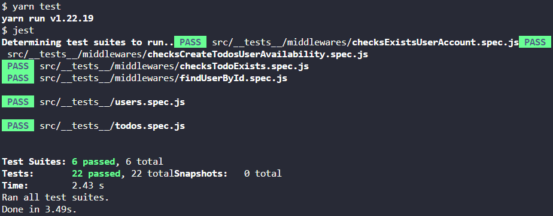
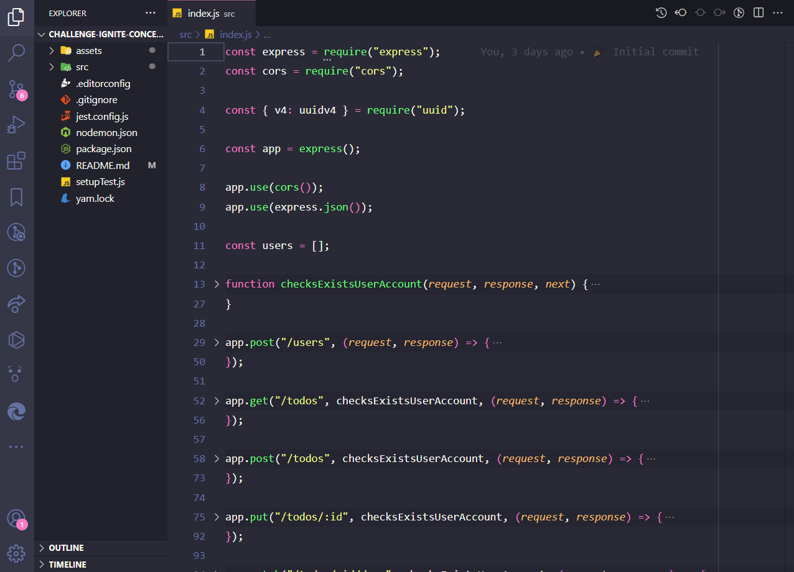

# Ignite Challenge 2 - NodeJS Track


<h3 align="center">
  Challenge 02: Working with Middlewares
</h3>

<p align="center">“Your only limitation is yourself”!</blockquote>

<p align="center">
  

  

  

  <a href="https://github.com/artur-duart/challenge-ignite-concepts-nodejs/stargazers">
    
  </a>
</p>

<p align="center">
  <a href="#rocket-about-the-challenge">About the challenge</a>&nbsp;&nbsp;&nbsp;|&nbsp;&nbsp;&nbsp;
  <a href="#keyboard-installation-and-execution-of-the-project">Installation and Execution of the Project</a>&nbsp;&nbsp;&nbsp;|&nbsp;&nbsp;&nbsp;
  <a href="#application-template">Application Template</a>&nbsp;&nbsp;&nbsp;|&nbsp;&nbsp;&nbsp;
  <a href="#application-middlewares-instructions">Application Middlewares</a>&nbsp;&nbsp;&nbsp;|&nbsp;&nbsp;&nbsp;
  <a href="#tests-specification-instructions">Tests Specification</a>&nbsp;&nbsp;&nbsp;|&nbsp;&nbsp;&nbsp;
  <a href="#memo-license">License</a>
</p>

## :rocket: About the challenge

In this challenge, I worked more deeply with middlewares in Express. This way, I was able to further fix the knowledge obtained so far.

To make it a little easier to understand the business rule, I worked with the same application as the previous challenge: an application to manage tasks (or _todos_) but with some changes: **[Challenge 1 - Node.js Concepts](https://github.com/artur-duart/challenge-ignite-concepts-nodejs)**

It will be allowed to create a user with `name` and `username`, as well as to do the CRUD of _todos_:

- Create a new _todo_;
- List all _todos_;
- Change the `title` and `deadline` of an existing _todo_;
- Mark a _todo_ as done;
- Delete a _todo_;

All this for each specific user. In addition, this time there is a free plan where the user can only create up to ten _todos_ and a Pro plan that will allow creating unlimited _todos_, all using middlewares to make the necessary validations.

### :keyboard: Installation and Execution of the Project

- Clone this repository

```
> git clone https://github.com/artur-duart/challenge-ignite-working-with-middlewares
```

- Navigate to the main directory of the project

```
> cd challenge-ignite-working-with-middlewares
```

- Install dependencies with Yarn

```
yarn
```

- Run the test suite

```
yarn test
```

- Run the project

```
yarn dev
```

<p align="center">
  
</p>

### Application Template

A template model was used that has the skeleton of the project.

The template can be found at the following url: **[Access Template](https://github.com/rocketseat-education/ignite-template-trabalhando-com-middlewares)**

> **Tip**: If you don't know how to use Github repositories as a template, use the guide in **[our FAQ](https://www.notion.so/ddd8fcdf2339436a816a0d9e45767664).**

Now navigate to the created folder and open it in Visual Studio Code, remember to run the `yarn` command in your terminal to install all dependencies, and you will have something like this:

<p align="center">
  
</p>

### Application Middlewares (Instructions)

Documentation on Notion about middlewares and tests: **[Documentation Middlewares and Tests](https://www.notion.so/Desafio-02-Trabalhando-com-middlewares-4f89bf538c2e4ee291382b92bdc36790)**

With the template already cloned and the `index.js` file open, you must complete where there is no code with the code to achieve the objectives of each test.

In this challenge, it will not be necessary to change the code of any route, **only of the middlewares**. The tests will also test the functioning of the routes but the result depends only on the middlewares.

Here we will have a brief description of what each middleware should do and in the [Tests Specification](https://www.notion.so/Desafio-02-Trabalhando-com-middlewares-4f89bf538c2e4ee291382b92bdc36790) section you will see in more detail what needs to be done to satisfy each test.

#### checksExistsUserAccount

This middleware is responsible for receiving the user's username through the header and validating whether or not there is a user with the passed username. If there is, the user must be passed to the request and the next function must be called.

#### checksCreateTodosUserAvailability

This middleware must receive the **user** already within the request and call the next function only if this user is still on the **free plan and does not yet have 10 _todos_ registered** or if he **is already on the Pro plan**.

#### checksTodoExists

This middleware must receive the **username** from within the header and the **id** of a _todo_ from within `request.params`. You must validate the user, validate that the `id` is a uuid and also validate that this `id` belongs to a _todo_ of the informed user.

With all validations passing, the _todo_ found must be passed to `request` as well as the user found also and the next function must be called.

#### findUserById

This middleware has a similar operation to the `checksExistsUserAccount` middleware but the search for the user must be done through the **id** of a user passed as a parameter in the route. If the user has been found, it must be passed within `request.user` and the next function must be called.

### Tests Specification (Instructions)

In each test, there is a brief description of what your application must fulfill for the test to pass.

> :bulb: If you have doubts about what tests are, and how to interpret them, take a look at **[our FAQ](https://www.notion.so/FAQ-Desafios-ddd8fcdf2339436a816a0d9e45767664)**

For this challenge, we have the following tests:

#### Middleware Tests

- **Should be able to find user by username in header and pass it to request.user**

  For this test to pass, you must allow the **checksExistsUserAccount** middleware to receive a username through request header and if a user with that same username exists, it should be placed inside `request.user` and, at end, return calling function `next`.

  Pay close attention to name of property that will store `user` object in request.

- **Should not be able to find a non existing user by username in header**

  For this test to pass, in **checksExistsUserAccount** middleware you must return a response with status `404` if username passed by request header does not belong to any user. You can also return an error message but this is optional.

- **Should be able to let user create a new todo when is in free plan and have less than ten todos**

  For this test to pass, you must allow **checksCreateTodosUserAvailability** middleware to receive `user` object (always consider that object exists) from `request` and call `next` function only if user is on **free plan and does not yet have 10 _todos_ registered** or if he **is already on Pro plan**.

  > :bulb: You can check if user has Pro plan or not from `user.pro` property. If it's `true`, it means Pro plan is in use.

- **Should not be able to let user create a new todo when is not Pro and already have ten todos**

  For this test to pass, in **checksCreateTodosUserAvailability** middleware you must return a response with status `403` if user received by request is on **free plan** and **already has 10 _todos_ registered**. You can also return an error message but this is optional.

- **Should be able to let user create infinite new todos when is in Pro plan**

  For this test to pass, you must allow **checksCreateTodosUserAvailability** middleware to receive `user` object (always consider that object exists) from `request` and call `next` function if user is already on Pro plan.

  > :bulb: If you satisfied the previous two tests before this one, it should pass as well.

- **Should be able to put user and todo in request when both exits**

  For this test to pass, the **checksTodoExists** middleware must receive the `username` from within the header and the `id` of a _todo_ from within `request.params`. You must validate that the user exists, validate that the `id` is a uuid and also validate that this `id` belongs to an _todo_ of the given user.

  With all validations passing, the _todo_ found must be passed to the `request` as well as the found user as well and the next function must be called.

  It is important that you put the found user inside `request.user` and _todo_ found inside `request.todo`.

- **Should not be able to put user and todo in request when user does not exist**

  For this test to pass, in the **checksTodoExists** middleware you must return a response with status `404` if there is no user with the `username` passed in the request header.

- **Should not be able to put user and todo in request when todo id is not uuid**

  For this test to pass, in the **checksTodoExists** middleware you must return a response with status `400` if the `id` of _todo_ passed by the request parameters is not a valid UUID (for example `1234abcd`).

- **Should not be able to put user and todo in request when todo does not exist**

  For this test to pass, in the **checksTodoExists** middleware you must return a response with status `404` if the `id` of the _todo_ passed by the request parameters does not belong to any _todo_ of the user found.

- **Should be able to find user by id route param and pass it to request.user**

  For this test to pass, the **findUserById** middleware must receive the `id` of a user from within the `request.params`. You must validate that the user exists, pass it on to `request.user` and return the next function call.

- **Should not be able to pass user to request.user when it does not exist**

  For this test to pass, in the middleware **findUserById** you must return a response with status `404` if the `id` of the user \*\*passed by the request parameters does not belong to any registered user.

---

All other tests are the same tests found in challenge 01 with some (or no) changes.

> :warning: It is worth emphasizing that this challenge is focused only on middlewares and you do not need to modify the content of the routes for the tests to pass 💜

## :memo: License

This project is licensed under the MIT license. See the [LICENSE](https://github.com/artur-duart/challenge-ignite-working-with-middlewares/blob/main/LICENSE) file for more details.

---

Made with 💜 by <a href="https://www.linkedin.com/in/artur-duart/">Artur Duarte</a> :wave:
